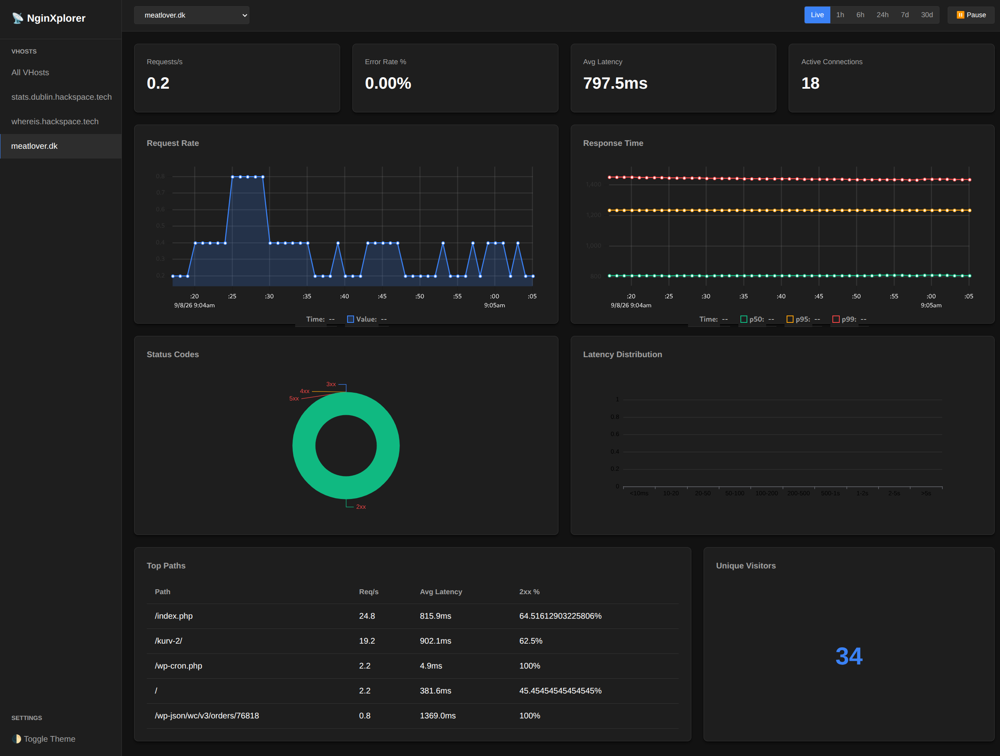
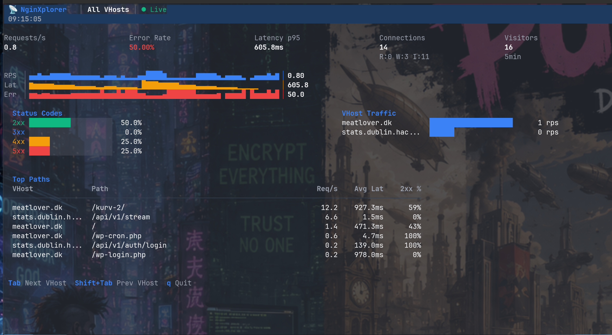

# ⚡ NginXplorer

> **Real-time Nginx statistics visualization tool** — Monitor traffic, connection states, response times, and per-virtual-host metrics with zero-overhead streaming.

[](LICENSE)
[](https://golang.org)
[](#roadmap)

---

## 📸 Screenshots

### Web Dashboard


### Terminal UI (TUI)


---

## ✨ Features

- **⚡ Real-Time Performance Metrics & Latency Histogram**:
  - Live requests-per-second (RPS) and active connections (reading, writing, waiting)
  - Connection rate, total accepted/handled counts, and drop detection
  - Request latency percentiles ($p_{50}$, $p_{95}$, $p_{99}$) using T-Digest / HDR Histograms
  - Interactive 10-bucket Latency Distribution histogram (`<10ms` to `>5s`) updating in real time
  - High-contrast, theme-reactive plot rendering for uPlot and ECharts across dark and light modes
  - Upstream response times and backend server health

- **🌐 Virtual Host & Endpoint Analytics**:
  - Auto-discovery and traffic segmentation across all Nginx virtual hosts (`server_name`)
  - Real-time HTTP status breakdown ($2xx$, $3xx$, $4xx$, $5xx$)
  - Top active request paths per virtual host with accurate 60-second sliding-window request rates and latencies
  - Bandwidth consumption tracking (incoming request bytes and egress payload)

- **🖥️ Dual Interface (Web & TUI)**:
  - **Embedded Responsive Web UI**: Single-binary dashboard with real-time SSE streaming, fluid auto-sizing charts via `ResizeObserver`, touch-friendly layout, and light/dark theme toggles
  - **Terminal UI (TUI)**: Interactive terminal dashboard built with [Bubble Tea](https://github.com/charmbracelet/bubbletea) for remote SSH sessions and headless servers

- **📈 Historical Deep-Dive & Persistence**:
  - Embedded SQLite database for zero-config long-term metrics storage
  - Queryable historical views (`Live`, `1h`, `6h`, `24h`, `7d`, `30d`) with aggregate metrics rollups
  - Automated database retention windows and background aggregation cleanup

- **🔔 Multi-Channel Alerting Engine**:
  - Real-time incident detection for error rate spikes (5xx/4xx), high p95/avg latency, and traffic drops
  - Low-traffic dampening (`min_requests` and `min_errors`) to prevent false alarms from sporadic bot scans
  - Multi-channel notification dispatchers: **ntfy.sh** (mobile push), **Pushbullet**, **Slack / Discord**, and **generic webhooks**
  - Integrated in-browser alerts modal with active incidents and historical incident logs

- **🤖 Bot & Crawler Traffic Segmentation**:
  - Real-time classification of requests into **Human Users**, **Verified Good Bots** (Google, Bing, DuckDuckGo, UptimeRobot, etc.), and **Malicious Scanners / Exploit Probes** (Sqlmap, Nikto, Nuclei, Gobuster, etc.)
  - Interactive rolling donut chart providing instant visibility into automated vs. organic traffic distributions

- **📱 Progressive Web App (PWA) & Mobile Installation**:
  - Installable home-screen app on iOS, Android, Windows, macOS, and Linux
  - Native mobile installation prompt banner with `beforeinstallprompt` integration on Android and guided Share-sheet instructions on iOS
  - High-resolution maskable PNG icons (192x192, 512x512) and offline application shell caching via Service Worker (`sw.js`)
  - Standalone fullscreen display with bespoke vector branding and status bar integration

- **🔒 Security & Privacy Built-In**:
  - Bcrypt-hashed user authentication for web access
  - IP anonymization (masks client IP octets for GDPR/compliance)
  - Query string scrubbing to prevent leaking sensitive request parameters
  - Unix domain socket listener for secure, local-only log ingestion

- **🚀 Zero Disk I/O Overhead**:
  - Ingests structured JSON logs directly from Nginx over a local Unix domain socket (`syslog:server=unix:...`)
  - No disk churn or log parsing bottlenecks

---

## 🚀 Quick Start

Get NginXplorer up and running in 3 simple steps:

### 1. Install NginXplorer

Clone the repository and build the binary:

```bash
git clone https://github.com/kimusan/nginxplorer.git
cd nginxplorer
make build
sudo make install
```

### 2. Configure Nginx

Copy the provided Nginx configuration snippets into your Nginx configuration directory (e.g. `/etc/nginx/conf.d/`):

```bash
# 1. Enable the stub_status endpoint (internal only)
sudo cp configs/nginx/nginxplorer-status.conf /etc/nginx/conf.d/

# 2. Enable real-time JSON log streaming
sudo cp configs/nginx/nginxplorer-log.conf /etc/nginx/conf.d/

# Test and reload Nginx
sudo nginx -t
sudo nginx -s reload
```

### 3. Run NginXplorer

Copy the example configuration, set up your credentials, and start the daemon:

```bash
# Create configuration directory
sudo mkdir -p /etc/nginxplorer /var/lib/nginxplorer
sudo cp configs/nginxplorer.example.yaml /etc/nginxplorer/config.yaml

# Run NginXplorer
nginxplorer --config /etc/nginxplorer/config.yaml
```

Open your browser at **`http://127.0.0.1:9100`** and log in with:
- **Username**: `admin`
- **Password**: `changeme` *(Be sure to change this! See [Security & Authentication](#-security-section))*

---

## 📦 Detailed Installation

### Prerequisites

- Linux (x86_64, aarch64, armv7)
- Nginx 1.13+ (compiled with `--with-http_stub_status_module`, standard in all major distributions)
- Go 1.22+ (only required if building from source)

### Package Managers & Releases (Recommended)

Pre-built binaries and native packages (`.deb`, `.rpm`, `.pkg.tar.zst`) for `x86_64`, `arm64`, and `armv7` are available on the [GitHub Releases](https://github.com/kimusan/nginxplorer/releases) page.

#### Debian / Ubuntu (`.deb`)

Download the `.deb` package for your architecture and install:

```bash
# Replace VERSION and ARCH (e.g. amd64, arm64)
curl -LO https://github.com/kimusan/nginxplorer/releases/latest/download/nginxplorer_linux_amd64.deb
sudo dpkg -i nginxplorer_linux_amd64.deb
```

#### RHEL / Fedora / CentOS / Rocky (`.rpm`)

Download the `.rpm` package and install via `dnf` or `rpm`:

```bash
# Replace VERSION and ARCH (e.g. x86_64, aarch64)
sudo dnf install https://github.com/kimusan/nginxplorer/releases/latest/download/nginxplorer_linux_amd64.rpm
# or: sudo rpm -i nginxplorer_linux_amd64.rpm
```

#### Arch Linux (`.pkg.tar.zst`)

Download the Arch package and install via `pacman`:

```bash
curl -LO https://github.com/kimusan/nginxplorer/releases/latest/download/nginxplorer_linux_x86_64.pkg.tar.zst
sudo pacman -U nginxplorer_linux_x86_64.pkg.tar.zst
```

#### Pre-built Tarball

```bash
curl -LO https://github.com/kimusan/nginxplorer/releases/latest/download/nginxplorer_Linux_x86_64.tar.gz
tar -xzf nginxplorer_Linux_x86_64.tar.gz
sudo install -Dm755 nginxplorer /usr/local/bin/nginxplorer
```

### Building from Source

```bash
# Clone repository
git clone https://github.com/kimusan/nginxplorer.git
cd nginxplorer

# Build binary
make build

# Run unit tests
make test

# Install binary and sample configs
sudo make install
```

### Running as a Systemd Service

Create a systemd unit file at `/etc/systemd/system/nginxplorer.service`:

```ini
[Unit]
Description=NginXplorer - Real-time Nginx Statistics
After=network.target nginx.service
Wants=nginx.service

[Service]
Type=simple
User=root
Group=root
ExecStart=/usr/bin/nginxplorer --config /etc/nginxplorer/config.yaml
Restart=on-failure
RestartSec=5s
LimitNOFILE=65535

# Sandboxing
ProtectSystem=full
ProtectHome=true
PrivateTmp=true

[Install]
WantedBy=multi-user.target
```

Enable and start the service:

```bash
sudo systemctl daemon-reload
sudo systemctl enable --now nginxplorer
sudo systemctl status nginxplorer
```

---

## 📟 Terminal UI (TUI) Mode

In addition to the web dashboard, NginXplorer includes a full terminal dashboard powered by Bubble Tea. It attaches directly to a local or remote NginXplorer instance via SSE.

### Starting the TUI

```bash
# Connect to local daemon (no auth or when auth disabled)
nginxplorer --tui

# Connect with username — securely prompts for password without leaking into shell history:
nginxplorer --tui --user admin
# Enter password for admin: [hidden input]

# Connect to a remote or TLS-secured instance:
nginxplorer --tui --connect https://stats.example.com --user admin

# Non-interactive / scripted attachment:
nginxplorer --tui --connect http://127.0.0.1:9100 --user admin --pass MySecretPassword
```

### TUI Keyboard Shortcuts

| Key | Action |
| :--- | :--- |
| `Tab` / `Shift+Tab` | Cycle through Virtual Hosts |
| `↑` / `↓` / `j` / `k` | Scroll Virtual Host list |
| `Space` | Pause / Resume live data stream |
| `t` | Cycle historical time ranges (`Live`, `1h`, `6h`, `24h`, `7d`, `30d`) |
| `q` / `Ctrl+C` | Exit TUI |

---

## 🌐 Production & Remote Access Setup

To expose NginXplorer securely on a subdomain (e.g. `https://stats.example.com`) with HTTPS and authentication:

### 1. Configure Password Authentication

Generate a secure bcrypt hash for your password:

```bash
nginxplorer hash-password
# Enter password: MySuperSecretPassword!
```

Add the generated hash to `/etc/nginxplorer/config.yaml`:

```yaml
server:
  bind: "127.0.0.1:9100"  # Keep bound to localhost behind Nginx

auth:
  enabled: true
  users:
    - username: admin
      password_hash: "$2a$10$..."  # Paste generated hash here
```

### 2. Configure Nginx Reverse Proxy with SSE Support

Create `/etc/nginx/sites-available/stats.example.com`:

```nginx
server {
    listen 80;
    listen [::]:80;
    server_name stats.example.com;

    location / {
        proxy_pass http://127.0.0.1:9100;
        proxy_set_header Host $host;
        proxy_set_header X-Real-IP $remote_addr;
        proxy_set_header X-Forwarded-For $proxy_add_x_forwarded_for;
        proxy_set_header X-Forwarded-Proto $scheme;

        # Crucial for real-time Server-Sent Events (SSE):
        proxy_http_version 1.1;
        proxy_set_header Connection "";
        proxy_buffering off;
        proxy_cache off;
        proxy_read_timeout 24h;
    }
}
```

Enable the site and test configuration:

```bash
sudo ln -s /etc/nginx/sites-available/stats.example.com /etc/nginx/sites-enabled/
sudo nginx -t
sudo systemctl reload nginx
```

### 3. Obtain Free HTTPS Certificate with Certbot

```bash
sudo certbot --nginx -d stats.example.com
```

---

## 🔍 Troubleshooting & Known Pitfalls

### 1. Nginx `access_log` in Virtual Hosts Overriding Global Logging
* **Symptom**: NginXplorer is running, but you only see `All VHosts` and no virtual hosts appear even when browsing websites.
* **Cause**: In Nginx, if an individual `server { ... }` block specifies its own `access_log`, it **completely overrides** any global `access_log` defined in `http { ... }` or `conf.d/`.
* **Fix**: Ensure the syslog streaming directive is added inside your active virtual host blocks (Nginx allows multiple `access_log` lines per server block):
  ```nginx
  server {
      server_name example.com;
      access_log /var/log/nginx/example.com.log;
      # Add this line to stream to NginXplorer:
      access_log syslog:server=unix:/var/run/nginxplorer.sock,tag=nginx nginxplorer;
      ...
  }
  ```

### 2. Socket Permission Denied (`/var/run/nginxplorer.sock`)
* **Symptom**: Nginx error log `/var/log/nginx/error.log` reports:
  `[alert] connect() failed (13: Permission denied) while logging to syslog, server: unix:/var/run/nginxplorer.sock`
* **Cause**: NginXplorer runs as root (or your user), creating the socket with restricted permissions (`0660`). Nginx worker processes run as an unprivileged user (`www-data` or `nginx`) and cannot write to it.
* **Fix**: NginXplorer automatically sets `0666` on creation. If running an older build, ensure the socket file has write permissions for the web server user:
  ```bash
  sudo chmod 0666 /var/run/nginxplorer.sock
  sudo systemctl reload nginx
  ```

### 3. Only `/index.php` Shown Instead of Real URLs (WordPress & CMS)
* **Symptom**: Top Paths table only shows `/index.php` for all visitor requests.
* **Cause**: Standard PHP-FPM / WordPress configs use `try_files $uri $uri/ /index.php?$args;`. In Nginx, `$uri` holds the internal rewritten path (`/index.php`), not what the visitor typed.
* **Fix**: In `/etc/nginx/conf.d/nginxplorer-log.conf`, make sure `"uri":"$request_uri"` is used instead of `"$uri"`. `$request_uri` captures the true requested path and permalink before internal rewrites.

### 4. Cloudflare `ERR_SSL_VERSION_OR_CIPHER_MISMATCH` on Sub-subdomains
* **Symptom**: Browser throws an SSL handshake error when accessing `https://sub.sub.domain.com` (e.g. `stats.dublin.example.com`).
* **Cause**: Cloudflare Free Universal SSL only covers single-level wildcards (`*.example.com`). It does **not** cover multi-level subdomains (`*.*.example.com`).
* **Fix**: In your Cloudflare DNS dashboard, change the DNS record for `stats.dublin` from **Proxied (Orange Cloud)** to **DNS Only (Grey Cloud)** so your browser connects directly to the Let's Encrypt certificate on your Nginx server.

### 5. Port 9100 Already in Use
* **Symptom**: Systemd logs report: `listen tcp 127.0.0.1:9100: bind: address already in use`.
* **Cause**: A manual foreground or background instance of `nginxplorer` was started before starting the systemd service.
* **Fix**: Find and terminate the existing process before enabling the service:
  ```bash
  sudo fuser -k 9100/tcp
  sudo systemctl restart nginxplorer
  ```

---

## ⚙️ Configuration Guide

NginXplorer searches for configuration in the following order:
1. File passed via `--config <path>`
2. `/etc/nginxplorer/config.yaml`
3. `~/.config/nginxplorer/config.yaml`
4. `./configs/nginxplorer.example.yaml` (fallback)

### Configuration Reference (`config.yaml`)

```yaml
# NginXplorer Configuration
# Copy this to /etc/nginxplorer/config.yaml or ~/.config/nginxplorer/config.yaml

server:
  # Address to bind the web dashboard
  bind: "127.0.0.1:9100"
  # Set to 0.0.0.0:9100 to expose remotely (requires auth)

auth:
  # Enable authentication (required when bind is not localhost)
  enabled: true
  # Username and password for web dashboard login
  # Password is stored as bcrypt hash. Generate with:
  #   nginxplorer hash-password
  users:
    - username: admin
      # Default password: 'changeme' — CHANGE THIS!
      password_hash: "$2a$10$K0E.nADuD0f39ELn1mV72uq75kL8whLrKex0g4Q9lE4CuRSRLpXQ2"

nginx:
  # stub_status URL (usually on localhost)
  stub_status_url: "http://127.0.0.1:8099/nginx_status"
  # How often to poll stub_status (milliseconds)
  stub_status_interval: 500
  
  # VTS module status URL (optional, leave empty to disable)
  vts_status_url: ""
  
  # Unix socket to receive JSON access logs from Nginx syslog
  log_socket: "/var/run/nginxplorer.sock"
  # Alternative: path to access log file to tail
  # log_file: "/var/log/nginx/access.log"

storage:
  # Path to SQLite database for historical data
  db_path: "/var/lib/nginxplorer/data.db"
  # Retention: how many days of historical data to keep
  retention_days: 30

metrics:
  # Maximum number of vhosts to track (memory sizing)
  max_vhosts: 50
  # Maximum number of top paths to track per vhost
  max_top_paths: 100
  # Maximum number of unique visitors window (minutes)
  visitor_window_minutes: 5

# Privacy settings
privacy:
  # Anonymize IP addresses (mask last octet)
  anonymize_ips: false
  # Don't log query strings
  strip_query_strings: true

# Alerting and Webhook Notifications
alerts:
  enabled: true
  dashboard_url: "https://stats.example.com"
  cooldown: "10m"
  rules:
    - name: "High Error Rate"
      vhost: "all"            # "all" or specific vhost (e.g. "example.com")
      metric: "error_rate"    # error_rate, latency_p95, latency_avg, zero_traffic
      threshold: 5.0          # 5.0%
      duration: "1m"          # must persist for at least 1 minute
      min_requests: 20        # dampening: require at least 20 reqs in window (avoids bot false alarms)
      min_errors: 5           # require at least 5 errors
    - name: "High Latency"
      vhost: "all"
      metric: "latency_p95"
      threshold: 1500.0       # ms
      duration: "2m"
      min_requests: 10
  channels:
    - type: "ntfy"
      url: "https://ntfy.sh/nginxplorer_alert"
    # - type: "pushbullet"
    #   api_token: "o.xxxxxxxxxxxxxxxxxxxxxxxxxxxxxxxx"
    # - type: "slack"
    #   url: "https://hooks.slack.com/services/..."
    # - type: "discord"
    #   url: "https://discord.com/api/webhooks/..."

# Logging
log:
  level: "info"   # debug, info, warn, error
  format: "text"  # text or json
```

### Options Description

| Parameter | Type | Default | Description |
| :--- | :--- | :--- | :--- |
| `server.bind` | string | `127.0.0.1:9100` | Address and port for web dashboard and API. |
| `auth.enabled` | boolean | `true` | Enforces session authentication for web and API access. |
| `auth.users` | list | `admin` | List of allowed users and their bcrypt password hashes. |
| `nginx.stub_status_url` | string | `http://127.0.0.1:8099/nginx_status` | URL of the Nginx `stub_status` endpoint. |
| `nginx.stub_status_interval`| int | `500` | Polling interval for `stub_status` in milliseconds. |
| `nginx.vts_status_url` | string | `""` | Optional URL for `nginx-module-vts` JSON status endpoint. |
| `nginx.log_socket` | string | `/var/run/nginxplorer.sock` | Unix domain socket path for zero-I/O syslog streaming. |
| `nginx.log_file` | string | `""` | Optional fallback path for file tailing. |
| `storage.db_path` | string | `/var/lib/nginxplorer/data.db` | Path to SQLite database for persistent metrics. |
| `storage.retention_days` | int | `30` | Number of days to preserve historical metric rollups. |
| `metrics.max_vhosts` | int | `50` | Maximum number of virtual hosts to track in memory. |
| `metrics.max_top_paths` | int | `100` | Maximum number of top request paths tracked per host. |
| `metrics.visitor_window_minutes`| int | `5` | Sliding window duration for active visitor tracking. |
| `privacy.anonymize_ips` | boolean | `false` | Masks the final octet of IPv4 / last 80 bits of IPv6 addresses. |
| `privacy.strip_query_strings` | boolean | `true` | Strips `?query=...` arguments before tracking paths. |
| `alerts.enabled` | boolean | `false` | Enables the background threshold alerting engine. |
| `alerts.dashboard_url` | string | `""` | Base dashboard URL included in outgoing notifications. |
| `alerts.cooldown` | string | `"10m"` | Minimum quiet period between repeat alerts for the same rule. |
| `alerts.rules` | list | `[]` | List of alerting rules (`error_rate`, `latency_p95`, `zero_traffic`). |
| `alerts.channels` | list | `[]` | Dispatcher destinations (`ntfy`, `pushbullet`, `slack`, `discord`, `webhook`). |
| `log.level` | string | `info` | Application log verbosity (`debug`, `info`, `warn`, `error`). |
| `log.format` | string | `text` | Log output format (`text` or `json`). |

---

## 🔧 Nginx Setup Guide

NginXplorer combines two high-efficiency telemetry streams:
1. **`stub_status`**: Provides instantaneous connection states (active, reading, writing, waiting) with minimal CPU overhead.
2. **JSON Log Streaming (`syslog`)**: Delivers rich per-request telemetry (vhost, response status, latency, upstream timing) over a Unix domain socket without disk I/O.

### 1. Configure `stub_status` Endpoint

Include `configs/nginx/nginxplorer-status.conf` in your Nginx configuration:

```nginx
# Internal-only server for status endpoints
server {
    listen 127.0.0.1:8099;
    server_name 127.0.0.1;

    # Basic stub_status (always available in open-source Nginx)
    location = /nginx_status {
        stub_status;
        allow 127.0.0.1;
        deny all;
        access_log off;
    }
}
```

### 2. Configure Structured JSON Log Streaming

Include `configs/nginx/nginxplorer-log.conf` inside your `http { ... }` block:

```nginx
# Structured JSON log format for NginXplorer
log_format nginxplorer escape=json '{'
    '"ts":"$time_iso8601",'
    '"host":"$server_name",'
    '"addr":"$remote_addr",'
    '"method":"$request_method",'
    '"uri":"$uri",'
    '"args":"$args",'
    '"status":$status,'
    '"bytes":$bytes_sent,'
    '"body_bytes":$body_bytes_sent,'
    '"req_len":$request_length,'
    '"req_time":$request_time,'
    '"upstream_time":"$upstream_response_time",'
    '"upstream_addr":"$upstream_addr",'
    '"upstream_status":"$upstream_status",'
    '"ua":"$http_user_agent",'
    '"ref":"$http_referer",'
    '"ssl_proto":"$ssl_protocol",'
    '"conn":"$connection",'
    '"conn_reqs":"$connection_requests"'
'}';

# Stream logs to NginXplorer via Unix domain socket (zero disk I/O)
access_log syslog:server=unix:/var/run/nginxplorer.sock,tag=nginx nginxplorer;
```

> [!NOTE]
> `access_log` directives in Nginx are additive. Streaming to NginXplorer will not interfere with or replace your existing access log files.

### 3. Optional: Virtual Host Traffic Status (VTS) Module

If you have compiled Nginx with [`nginx-module-vts`](https://github.com/vozlt/nginx-module-vts):

1. Add `vhost_traffic_status_zone;` to your `http {}` block in `nginx.conf`.
2. Uncomment the `/vts_status` location block in `nginxplorer-status.conf`:

```nginx
location /vts_status {
    vhost_traffic_status_display;
    vhost_traffic_status_display_format json;
    allow 127.0.0.1;
    deny all;
    access_log off;
}
```
3. Set `vts_status_url: "http://127.0.0.1:8099/vts_status"` in `config.yaml`.

---

## 🔐 Security Section

### 1. Authentication & Password Hashing

NginXplorer enforces bcrypt password verification. **Never commit raw passwords.**

Generate a password hash using the built-in command:

```bash
nginxplorer hash-password
# Or via make:
make hash-password
```

Paste the resulting hash string into the `password_hash` field under `auth.users` in `config.yaml`.

### 2. Network Binding Isolation

- **Local-Only (Recommended)**: Keep `server.bind: "127.0.0.1:9100"`. Access the dashboard via SSH port forwarding:
  ```bash
  ssh -L 9100:127.0.0.1:9100 user@remote-server
  ```
- **Remote Exposure**: If setting `server.bind: "0.0.0.0:9100"`, ensure `auth.enabled: true` is set, and place NginXplorer behind a reverse proxy handling TLS.

### 3. Reverse Proxy with TLS (Nginx Example)

To expose NginXplorer over HTTPS with TLS termination:

```nginx
server {
    listen 443 ssl http2;
    server_name nginxplorer.example.com;

    ssl_certificate     /etc/letsencrypt/live/nginxplorer.example.com/fullchain.pem;
    ssl_certificate_key /etc/letsencrypt/live/nginxplorer.example.com/privkey.pem;

    location / {
        proxy_pass http://127.0.0.1:9100;
        proxy_http_version 1.1;
        
        # Required for Server-Sent Events (SSE) live streaming
        proxy_set_header Connection '';
        proxy_buffering off;
        proxy_cache off;
        proxy_read_timeout 24h;

        proxy_set_header Host $host;
        proxy_set_header X-Real-IP $remote_addr;
        proxy_set_header X-Forwarded-For $proxy_add_x_forwarded_for;
        proxy_set_header X-Forwarded-Proto $scheme;
    }
}
```

### 4. Unix Socket Permissions

The Unix domain socket (`/var/run/nginxplorer.sock`) receives syslog messages from the Nginx worker processes. Ensure the Nginx user (e.g. `www-data` or `nginx`) has write permissions:

```bash
# If NginXplorer runs as root or nginx group:
sudo chown root:www-data /var/run/nginxplorer.sock
sudo chmod 660 /var/run/nginxplorer.sock
```

---

## 🏗️ Architecture Overview

```
 ┌────────────────────────────────────────────────────────┐
 │                      Nginx Master                      │
 │    ┌──────────────────┐        ┌──────────────────┐    │
 │    │   stub_status    │        │  syslog stream   │    │
 │    │ (HTTP /status)   │        │ (Unix Domain Sk) │    │
 └────┴────────┬─────────┴────────┴────────┬─────────┴────┘
               │ Polling                   │ Push
               ▼                           ▼
 ┌────────────────────────────────────────────────────────┐
 │                      NginXplorer                       │
 │  ┌──────────────────────────────────────────────────┐  │
 │  │                 Collector Layer                  │  │
 │  │  • StubStatusPoller    • LogStreamListener       │  │
 │  │  • VTSPoller (opt)     • FileTailer (fallback)   │  │
 │  └──────────────────────────┬───────────────────────┘  │
 │                             ▼                          │
 │  ┌──────────────────────────────────────────────────┐  │
 │  │             Metrics Store & Engine               │  │
 │  │  • Real-time sliding windows (1m, 5m, 1h)        │  │
 │  │  • Percentile calculations (p50, p90, p99)       │  │
 │  │  • Per-vhost counters & top path frequency       │  │
 │  └──────────────┬────────────────────────┬──────────┘  │
 │                 │ Persist                │ Broadcast   │
 │                 ▼                        ▼             │
 │  ┌──────────────────────────┐ ┌─────────────────────┐  │
 │  │     SQLite Storage       │ │   SSE Hub & API     │  │
 │  │  • Historical rollups    │ │  • /api/v1/live     │  │
 │  │  • Retention cleaner     │ │  • /api/v1/metrics  │  │
 │  └──────────────────────────┘ └──────────┬──────────┘  │
 └──────────────────────────────────────────┼─────────────┘
                                            │
                     ┌──────────────────────┴──────────────────────┐
                     ▼                                             ▼
          ┌─────────────────────┐                       ┌─────────────────────┐
          │ Embedded Web UI     │                       │ Bubble Tea TUI      │
          │ (Single-Page App)   │                       │ (Terminal Console)  │
          └─────────────────────┘                       └─────────────────────┘
```

### Components

- **Collector Layer** (`internal/collector/`): Decoupled collectors ingest telemetry from Nginx via HTTP (`stub_status`, VTS) or Unix domain sockets (`syslog` JSON log streaming).
- **Metrics Store** (`internal/metrics/`): Concurrent in-memory ring buffers and sliding-window buckets aggregate requests per second, calculate latencies using HDR Histograms, and track top paths.
- **Storage Layer** (`internal/storage/`): Embedded SQLite database persists metrics rollups (1m, 5m, 1h aggregates) with automated pruning based on configured retention.
- **API & SSE Hub** (`internal/api/`): Fast HTTP API serving JSON snapshots and a Server-Sent Events (SSE) channel for sub-second web updates.
- **Visualization** (`web/` & `internal/tui/`): Embedded web dashboard and terminal interface consuming the unified metrics stream.

---

## 💻 Development

### Prerequisites

Ensure Go 1.22+ is installed and available in your environment:

```bash
export PATH="/home/linuxbrew/.linuxbrew/bin:$PATH"
go version
```

### Development Commands

The included `Makefile` provides standard development targets:

```bash
# Compile binary
make build

# Run in development mode with example configuration
make dev

# Run unit and race tests
make test

# Run metrics engine benchmarks
make bench

# Format codebase
make fmt

# Run static analysis linter
make lint

# Clean build artifacts
make clean
```

---

## 🗺️ Roadmap

- [x] **Phase 1: Core Engine & Web Dashboard**
  - [x] Configuration parser (`internal/config`)
  - [x] `stub_status` HTTP poller (`internal/collector`)
  - [x] Unix socket JSON log listener (`internal/collector`)
  - [x] In-memory sliding window metric aggregator (`internal/metrics`)
  - [x] SQLite historical persistence (`internal/storage`)
  - [x] Real-time Server-Sent Events (SSE) broadcaster (`internal/api`)
  - [x] Embedded responsive web dashboard (`web/`)

- [x] **Phase 2: Terminal UI (TUI)**
  - [x] Interactive Bubble Tea dashboard (`internal/tui`)
  - [x] Terminal sparklines and real-time ASCII charts
  - [x] Keyboard navigation for inspecting vhosts and drill-downs
  - [x] Headless/SSH remote attachment mode

- [x] **Phase 3: Alerting, Mobile PWA & Bot Segmentation**
  - [x] Real-time threshold alerting engine (error rate spikes, latency degradation, zero traffic)
  - [x] Low-traffic dampening (`min_requests`, `min_errors`) to prevent bot false positives
  - [x] Multi-channel notification dispatchers (ntfy.sh mobile push, Pushbullet, Slack, Discord, webhook)
  - [x] Web dashboard alerts modal & notification bell with live firing count
  - [x] Fluid mobile-responsive layout (`ResizeObserver`, touch scrolling tables, responsive topbar)
  - [x] Progressive Web App (PWA) support (`manifest.json`, offline-capable Service Worker, standalone home screen app)
  - [x] Mobile PWA installation prompt banner (Android `beforeinstallprompt` & iOS Safari guidance)
  - [x] High-resolution maskable icons (192px / 512px)
  - [x] Bot & crawler traffic segmentation (Human vs. Good Search/Monitoring Bots vs. Abusive Scanners) with real-time donut chart
  - [x] Historical time ranges (`Live`, `1h`, `6h`, `24h`, `7d`, `30d`) with SQLite rollups
  - [x] 10-bucket real-time latency distribution histogram and percentiles
  - [x] High-contrast canvas plot theming for dark and light modes
  - [x] Rolling 60s window tracking for accurate path req/s

- [ ] **Phase 4: Ecosystem & Advanced Telemetry**
  - [ ] Prometheus `/metrics` exporter endpoint
  - [ ] Telegram notification channel
  - [ ] Exportable reports (CSV / JSON data dumps)

---

## 🤝 Contributing

Contributions are welcome and appreciated! To contribute:

1. Fork the repository
2. Create your feature branch (`git checkout -b feature/amazing-feature`)
3. Commit your changes (`git commit -m 'feat: add amazing feature'`)
4. Verify tests and linting (`make test && make lint`)
5. Push to the branch (`git push origin feature/amazing-feature`)
6. Open a Pull Request

Please ensure your code follows Go best practices and includes tests where applicable.

---

## 📄 License

This project is licensed under the MIT License — see the [LICENSE](LICENSE) file for details.
